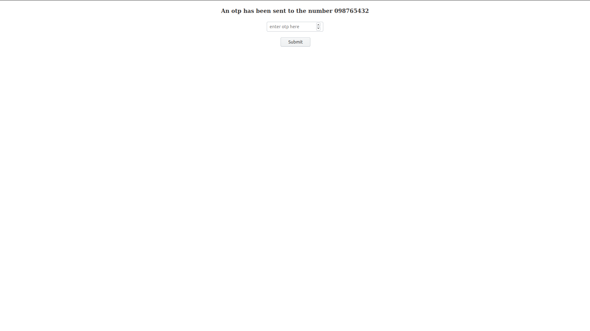

# scrapper
  This is a simple web app which send it's user the details of COVID-19 affected people in india through text messages.
   It fetches the data from [here](https://www.worldometers.info/coronavirus/country/india/)

  # Things you will need
    1 _sql server_
    2 _Nexmo messaging API_
    3 _check the package.json for dependencies_
    4 _make sure you set get your own virtual number and edit the corresponding lines of code_
    
# Screenshots

# Make sure you replace the following snippets in _server/index.js_ and _public/javascript/scrap_
